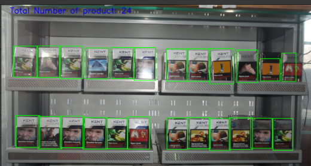
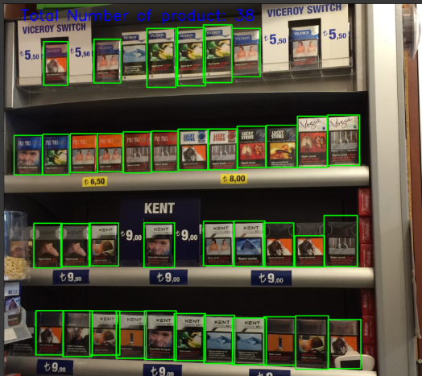

# Grocery_detection
Detecting products on shelves image with SDD

### Objective
The task is to detect the products on grocery dataset using SDD (Single shot Detection). The notebook is used in Google Colab for accessing GPU. It also contains the installation of Tensorflow Object Detection API.
For installing [Tensorflow object detection API](https://github.com/tensorflow/models/blob/master/research/object_detection/g3doc/installation.md)

### Reference
- Python script for tensorflow Object detection on grocery dataset by [empathy87](https://github.com/empathy87/nn-grocery-shelves)
- Dataset is provided by Gül Varol and Kuzu, Ridvan S. for the title "Toward Retail Product Recognition on Grocery Shelves" in 2014.

### Prerequisite
- Tensorflow object detection API
- Tensorflow 1.0
- Opencv-python
- Pandas
- Matplotlib
- Numpy
- os
- io
- Sklearn
- Pillow
- Collections

### Example

